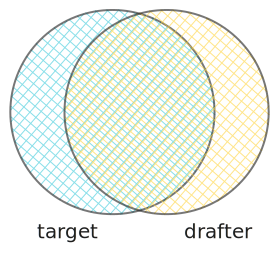

<!-- header: "" -->
<!-- paginate: skip -->

## Advances in Speculative Decoding

Nadav Timor (Weizmann Institute of Science)

Based on joint work with: Jonathan Mamou, Daniel Korat, Moshe Berchansky, Gaurav Jain, Michal Gordon-Kiwkowitz, Tomer Galanti, Roy Schwartz, Oren Pereg, Moshe Wasserblat, David Harel

---

<!-- paginate: true -->

# Inference optimization matters

* Trivial: lowers latency & cost
* Nontrivial: improves quality
    * Quality correlates w/ thinking (aka reasoning/rollouts)
    * More thinking within budget

<!--
* How much companies spent on compute and inference? Give a numerical example to provide a sense of how much our improvements saves.
* IMO gold medals.
-->

---

# Speculative decoding &nbsp;&nbsp;<span style="font-size: 0.5em;">[Leviathan et al., 2023; Chen et al., 2023]</span>

<br>

* <span style="color: red;">Autoregressive decoding</span>
    
* <span style="color: green;">Speculative decoding</span>
    
    * <span style="color: green;">up to 3x faster ($\downarrow$ latency, $\uparrow$ throughput)</span>
    * <span style="color: green;">lossless</span>

<!--
* Autoregressive decoding is a main bottleneck in LLM inference. In autoregressive decoding, each forward pass generates a single token.
* Speculative decoding accelerates the inference. It employs a faster "drafter" model that proposes several "draft" tokens ahead, and then the original "target" model validates them in parallel.
* It's often 2-3x faster *than autoregressive*, as reported in the literature.
* The primary advantage over other acceleration methods is losslessness. Speculative decoding preserves the target distribution.
* However, there's a major problem with the drafting phase (the left part of the illustration).
-->

<!-- FIGURES: Compile `mmd` files in `figures/` on `mermaidchart.com` to get the SVGs. -->

---

Today:
1. heterogeneous vocabs (ICML '25 oral; default in $🤗$ Transformers)
2. speculation parallelism (ICLR '25)
3. dynamic lookahead (NeurIPS workshop '24; default in $🤗$ Transformers)


---

## Accelerating LLM Inference with Lossless Speculative Decoding Algorithms for Heterogeneous Vocabularies

***Nadav Timor***$~^w$, Jonathan Mamou$^\mathcal{i}$, Daniel Korat$^\mathcal{i}$, Moshe Berchansky$^\mathcal{i}$, Gaurav Jain$^\mathcal{d}$, Oren&nbsp;Pereg$^\mathcal{i}$, Moshe Wasserblat$^\mathcal{i}$, David Harel$^w$

$^w~$Weizmann Institute of Science, $^\mathcal{i}~$Intel Labs, $^\mathcal{d}~$d-Matrix

<div style="position: absolute; bottom: 45px; right: 120px;">
    
</div>

<!--
Welcome, everyone!
I’m Nadav Timor from the Weizmann Institute.
With my awesome collaborators, we've recently made speculative decoding *free* and *more accessible* to everyone.
-->

<!-- QR code generated by:
https://api.qrserver.com/v1/create-qr-code/?size=200x200&data=https://openreview.net/forum?id=vQubr1uBUw
-->

---

# Contribution: Removing the shared-vocab constraint

<br>

<span style="color: red;" data-marpit-fragment>**Current limitation:** drafter must share the same vocab as the target</span>
* <span style="color: red;">$💸$ Training drafters from scratch:</span>
    * <span style="color: red;">No family</span> (e.g., `DeepSeek-R1`, `phi-4`, `Mixtral-8x22B`, `CodeLlama`)
    * <span style="color: red;">In-family is too slow</span> (e.g., `DeepSeek-R1-Distill-*`, `Llama 3.1`, `gemma-2`)
    * <span style="color: red;">No reuse</span>

<span style="color: green;" data-marpit-fragment>**Our contribution:** removing this limitation (\& remaining lossless)</span>
* <span style="color: green;">$🆓$ No training:</span>
    * <span style="color: green;">Any off-the-shelf drafter</span>
    * <span style="color: green;">Reuse</span>
* <span style="color: green;">Up to 2.8x faster (than autoregressive)</span>
* <span style="color: green;">Default in $🤗$ Transformers (since Oct '24 + Feb '25)</span>

<!-- 

-->

---

# Usage example

```diff
from transformers import pipeline

pipe = pipeline(
    "text-generation",
    model="google/gemma-2-9b-it",
-   assistant_model="google/gemma-2-2b-it"
+   assistant_model="double7/vicuna-68m"        # 1.5x lossless speedup!
)
out = pipe("Summarize this article...")
```

<!--
DETAILS:
- `gemma-2-2b-it` slows down to 0.9x; `vicuna-68m` speeds up to 1.4x
- CNN-DM
- 1 H100
-->

---

# Our 3 algos

- <span style="color: red;">Speculative decoding is undefined for heterogeneous vocabs</span>
1) TLI, Token-level intersection $🤗$
    * vocab pruning
2) SLEM, String-level exact match $🤗$
    * back-and-forth tokenization + heuristic
3) SLRS, String-level rejection sampling
    * probs on strings
* How to choose?

<!--
"In fact, we solved it 3 times. We developed 3 alternative algorithms."

-->

---

# Theoretical guarantees

* Lossless
* Acceptance rate (expected)
* Acceptance rate is higher than baseline

---

# Empirical speedups

- **Up to 2.8$\times$ toks/sec**
* Various hardware
* Tasks:
    - summarization
    - coding
    - long-context understanding
* Independent evaluation by Hugging Face

<!--
* In experiments on various tasks,
* both SLEM and TLI unlock significant speedups with off-the-shelf models.
* For DeepSeek-R1 and Gemma-2 we found tasks where a faster heterogeneous drafter outperforms in-family drafters.
* We contributed our code to Hugging Face Transformers, and the maintainers independently evaluated our methods.
-->

<!-- Datasets:
- Summarization: CNN-DailyMail
- Coding: HumanEval
- Long-context understanding: SCROLLS
-->

---

# Summary: free-lunch for everyone

* Speculative decoding with any off-the-shelf drafter
* Unlocks **lossless** speedups that previously required training
* Default in $🤗$ (388k repos + 6k libs)

<!-- 
To conclude,
* we've successfully removed the shared-vocab constraint in speculative decoding,
* allowing any model to operate as a drafter as-is.
-->

---

<!-- paginate: skip -->

# Qs?

<span style="color: blue;">Poster session, **4:30-7:00 pm** ($📍$East Exhibition Hall A-B #E-2810)</span>

<br>

> **Summary:** free-lunch for everyone
> 1. Speculative decoding with any off-the-shelf drafter
> 2. Unlocks lossless speedups that previously required training
> 3. Default in $🤗$ (388k repos + 6k libs)

<div style="position: absolute; bottom: 45px; right: 120px;">
    
</div>

---

# Thank you!

<span style="color: blue;">Poster session, **4:30-7:00 pm** ($📍$East Exhibition Hall A-B #E-2810)</span>

<br>

> **Summary:** free-lunch for everyone
> 1. Speculative decoding with any off-the-shelf drafter
> 2. Unlocks lossless speedups that previously required training
> 3. Default in $🤗$ (388k repos + 6k libs)

<div style="position: absolute; bottom: 45px; right: 120px;">
    
</div>

<!-- 
Thank you for your attention!
And a special thanks to my co-authors for their contributions.
Please feel free to email me with any feedback or reach out during the conference.
-->

---

# Appendix

- Speculative decoding recap
- Heterogeneous vocabulary challenge
- SLEM
- SLRS
- TLI
- Detailed empirical results

---

# Speculative decoding recap

* **Algo (informal):** Repeat until generated $N$ tokens:
    * $k$ drafter fwds
    * $1$ target fwd (batching)
    * lossless rejection sampling (accept / reject \& resample)

* **Intuition:**
    $$
    1 \text{ target fwd } ~~\rightarrow~~~~~>1 \text{ new tokens}
    $$

<!--
* Let’s quickly revisit how standard speculative decoding works, and why it's helpful.
* The process is iterative. In each step, a fast drafter generates a sequence of *k* candidate tokens.
* Then, in a *single* forward pass, the large target model verifies these tokens.
* We use a lossless rejection sampling step to ensure the output distribution is identical to the original model.
* The key intuition for the speedup over autoregressive decoding is that one expensive target forward pass can yield multiple new tokens rather than just one.
-->

---

# Heterogeneous vocabulary challenge

* Tokens outside the intersection have **no “natural” 1-to-1 mapping**
    <!-- 
    * Example: -->
    $$
    \begin{aligned}
    \text{‘rainbow’} &\rightarrow \text{‘rain’} \oplus \text{‘bow’} \\
    &\rightarrow \text{‘r’} \oplus \text{‘a’} \oplus \text{‘i’} \oplus \text{‘n’} \oplus \text{‘b’} \oplus \text{‘o’} \oplus \text{‘w’}
    \end{aligned}
    $$
* **Observation:** natural 1-to-n exists
<!-- * Need to guarantee: losslessness + high acceptance rate -->

<!--
* When the drafter and target models use different vocabularies, there is no natural 1-to-1 mapping between their tokens.  
* For example, the drafter might split ‘rainbow’ into ‘rain’ + ‘bow’, or even into individual characters.  
* Despite this, we need to guarantee two properties: *losslessness*—namely, preserving the exact target distribution—and *high acceptance rates*.  
* A key insight from common tokenizer-construction methods is that they’re designed to be *expressive*—able to tokenize any string. In practice, we observed that a natural 1-to-n mapping always exists between tokens.
-->

<!-- https://excalidraw.com/?#json=ngkMD7LpxnvstAqsr7CGe,Nk_nfFmiCi7Dr1cj7Xa5iw -->

---

# String-Level Exact Match (SLEM)

- **Algo (informal):**
    1) Drafter outputs $k$ draft tokens → untokenize to string $S$
    2) Tokenize $S$ w.r.t. target → target token sequence $(t_1, \ldots, t_m)$
    3) Target outputs $(t'_1, \ldots, t'_m, t'_{m+1})$ via batching
    4) Accept $(t_1, \ldots, t_{j-1}, t'_j)$
    i.e., longest matched prefix + first unmatched target token

* **Primary challenge:** non-injective tokenizers
    $$
    s \ne \text{untokenize}(\text{tokenize}(s))
    $$
    * Our heuristic (covers common cases):
        $$
        c_2 \oplus s = \text{untokenize}(\text{tokenize}(c_1 \oplus c_2 \oplus s))
        $$

<!-- 
- Based on this observation, we designed two algorithms that operate at the string level rather than the token level. SLEM is the simpler one.
* We generate *k* drafts autoregressively, as in standard speculative decoding, and then concatenate them into a single string *S*.  
* We tokenize *S* with respect to the target vocabulary, resulting in the target token sequence *t₁* through *tₘ*.  
* Using batching, we run a single forward pass of the target model, which outputs *t'_1* through to m+1.
* In the final step, we use exact matching instead of the standard speculative decoding verification: we accept the longest prefix of drafts that matches the target, plus one additional target token. Since SLEM employs exact matching, it outputs exactly the same tokens the target model would—an even stronger guarantee than merely preserving the target distribution.  
* SLEM uses strings as a common representation: it tokenizes and untokenizes at decode time, unlike standard speculative decoding, which tokenizes only the initial prompt and final output. A primary challenge is that tokenizers are often “non-injective,” meaning tokenizing a string then detokenizing it may produce a different string. If not handled correctly, these edge cases can hurt acceptance rates, because tokenizers often apply normalization rules (for example, removing or squashing leading whitespace).
* To address prefix-modifying normalization rules, SLEM introduces a heuristic: instead of tokenizing the new string directly, it tokenizes the concatenation of a known string (with known token IDs) and the new string. 

- SLEM’s advantages are simplicity and losslessness; however, its acceptance rate may be low due to exact matching, which can reject tokens even if the drafter is the same model as the target. For this reason, we introduce a second algorithm that remains lossless but guarantees higher acceptance rates.  

---

Example:
1. If the first draft token has leading whitespaces, the target token in step 2 will be different. 
2. Note that the last token is necessarily from the target. When iterating, this last token becomes the prompt for the drafter, hence must be mapped to the drafter's vocabulary.
-->

---

# String-Level Rejection Sampling (SLRS)

- **Algo (informal):**
    1) Drafter outputs $k$ draft tokens → untokenize to string $S$
    2) Tokenize $S$ w.r.t. target → target token sequence $(t_1, \ldots, t_m)$
    3) SD verification between target $p(t_1)$ and generalized drafter $\psi(t_1)$:
        * Accept $t_1$ if $p(t_1) > \psi(t_1)$ else w.p. $p(t_1)/\psi(t_1)$
* Example:
    $$
    \psi(‘\text{hey}’) = q(‘\text{hey}’) + q(‘\text{he’}, \text{‘y’}) + q(‘\text{h’}, \text{‘ey’}) + q(‘\text{h’}, \text{‘e’}, \text{‘y’})
    $$
* **Thm:**
    - lossless
    * higher acceptance rate than SLEM

<!--
- SLRS is the first speculative decoding algorithm to apply rejection sampling at the string level.
* It starts like SLEM, by generating k drafts,
* and retokenizing them with respect to the target vocabulary.
* The key difference of SLRS is the use of a generalized drafter probability psi.
* SLRS employs the standard verification method of speculative decoding, but plugs-in the generalized drafter psi instead of the standard drafter.
* The generalized drafter is defined as the probability of the drafter generating a certain string, which is the sum of the probabilities of all possible tokenizations that concatenate to that string.
* We prove that SLRS is lossless and
* has a higher acceptance rate than SLEM, thanks to its verification method.

- Despite the higher acceptance rate, SLRS is impractical with today's vocabularies. Computing psi(t_1) requires computing the drafter's probability for all the possible sequences that concatenate to t_1. In practice, the number of drafter fwds grows quickly with the token length. For vocabularies of SoTA models that contain long strings, the computational cost is too high. But you can think about designing new vocabularies to fix this.
-->

---

# Token-Level Intersection (TLI)

* A sampler for the drafter
* **Algo (informal):**
    1) Zero-out probabilities outside the intersection
    2) Normalize
* **Thm:** higher acceptance rate (than naive “union” approach)

<!--
Our third algorithm, TLI, works at the token level.
* It is a sampler that modifies the drafter's distribution.
* The algorithm is simple:
* it zeroes out the drafter's probabilities for any tokens not in the target's vocabulary,
* then renormalizes the remaining probabilities.
* TLI remains lossless because it uses the standard verification method of speculative decoding. Additionally, we prove that TLI increases acceptance rates thanks to avoiding sampling tokens that would be rejected anyway.
-->

---

# Detailed empirical results

* **Tasks:** summarization (CNN-DailyMail), code generation (HumanEval), long-context understanding (SCROLLS) on various hardware setups
* **Speedups:**
    - up to 1.7$\times$ (TLI) and 2.8$\times$ (SLEM) tokens per second  
    * SLEM & TLI outperform homogeneous SD (e.g., DeepSeek-R1, Gemma-2)
    * independent evaluation by Hugging Face

<!--
* In experiments on various tasks,
* both SLEM and TLI unlock significant speedups with off-the-shelf models.
* For DeepSeek-R1 and Gemma-2 we found tasks where a faster heterogeneous drafter outperforms in-family drafters.
* We contributed our code to Hugging Face Transformers, and the maintainers independently evaluated our methods.
-->

---

## Speculation Parallelism and Distributed Speculative Decoding

Placeholder header slide — fill authors, venue, and link

---

## Dynamic Speculation Lookahead Scheduling

Placeholder header slide — fill authors, venue, and link